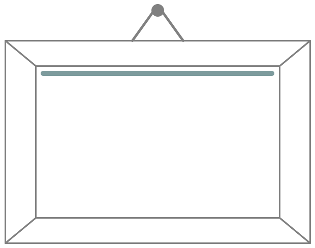

## Welcome!

**FuncSS** will be a new language for the browser. It will be CSS, with programming capabilities like custom functions and selectors. But unlike SCSS and LESS, it will be compiled to JavaScript and run on the client.

### How will we use it?

You define functions in JavaScript and use it in FuncSS:


$F.pictureAngle = function() {
    return Math.sin($F.t() * 3) * 0.08;
}



@function pictureAngle():<angle>;

#picture:hover {
    transform: translate(0,-48%) rotate(
          pictureAngle()   /* here */
        ) translate(0,48%);
}


### How will it work?

Library functions like `t()` (which returns the time spent since page loading) will automatically set up the mechanism for notifying the system when their value changes (e.g. set up an interval). Then the CSS will be updated. When the FuncSS stylesheet does not need the value anymore (e.g. the element is removed from the DOM), the updating will be stopped (the interval will be cleared). All this will be done by a tasty mixture of the hilarious [jQuery](http://jquery.com/) and the awesome [Tracker](http://www.meteor.com/tracker) libraries, called [jqReact](https://github.com/funcss-lang/jqReact).

### When can we get it?

A working prototype will be released in the following months. You can already look at the [FuncSS repository](https://github.com/funcss-lang/funcss) on Github.

### What other features will it have?

Among others, it is planned to have:

* automatic conversion between CSS and JavaScript data types
* function definition in pure FuncSS (e.g. using standard CSS functions)
* custom pseudoclasses and pseudoelements
* custom media queries
* inclusion of verbatim JavaScript into FuncSS files

For a complete list of planned features, see the [Trello board](https://trello.com/b/EpfkVhaA/funcss).

### Will it be open-source?

Yes. The language specifications will be released with an open license, and the Reference Implementation will be open-source, with MIT license. 

### Will it support my CSS preprocessor?

Probably. The syntax of FuncSS is similar to pure CSS. While most CSS preprocessors will shout at you for the `@function` declaration above, they will most probably completely accept the `#picture:hover` rule. So a solution is to only pass your preprocessor through a pure CSS-like part of your FuncSS code. This can be achieved with `@include`s. You can `@include "myfile.less";`, and the FuncSS compiler will run LESS on it before parsing it.

However, as you'll start to use FuncSS, you'll hopefuly find that some preprocessor  features can be easily replaced with FuncSS features, and this produces nicer code. In the future, also some common preprocessor features like rule nesting could be imported to FuncSS. But not yet, so for now it is advisable to use your favorite preprocessor along with FuncSS.

